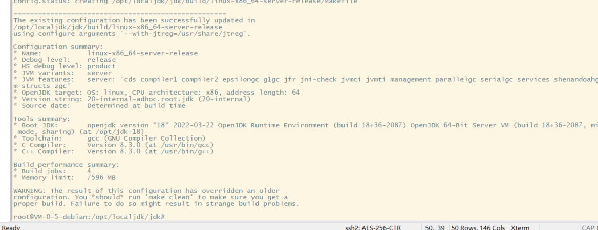

# Tencent Rhino-Bird Open Source Event 2022

This repository is used to record participation in Tencent 2022 Rhino-Bird open source activities.

# Project Introduction

- [2022腾讯犀牛鸟开源人才培养计划-Tencent konajdk](https://github.com/Tencent/OpenSourceTalent/issues/34)
- [Project Participant Selection List](https://lexiangla.com/teams/k100046/docs/34cb1a36042111eda898d647c4fa5509)

## Task1

**Finding OpenJDK flaws and fixes**

- [Bug issue for OpenJDK 20](https://bugs.openjdk.org/browse/JDK-8290775)
- Pushed as commit [`3e12241`](https://github.com/openjdk/jdk/commit/3e122419b2979235f57c0dd549ca63647ea73753)

**Build OpenJDK**

Please refer to : [Building the JDK](https://openjdk.org/groups/build/doc/building.html)

## Taks2

Please refer to [task2_report](https://github.com/jquanC/TencentOpenSourceRb/blob/main/task2/OpenJDKTest/report/task2report.md)

## Task3

Please refer to [task3_report](https://github.com/jquanC/TencentOpenSourceRb/blob/main/task3/SM2KeyPairBC/task3_report/task3_report.md)
