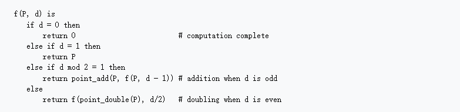

# Task-3: SM2 Key Pair Generation

## Project Background

- [2022腾讯犀牛鸟开源人才培养计划-Tencent konajdk](https://github.com/Tencent/OpenSourceTalent/issues/34)

Overall, in this task, we will write test programs to test the performance of ECDSA in OPENJDK11, including using two different elliptic curves secp256r1 and secp256k1. The test tools used include JMH, Java Profiler.


## Task requirement

### Description

Apply the tools in OpenJDK sun.security.util.math and sun.security.ec to the national secret SM2 algorithm to generate a key pair for SM2.
Need to consider: How to verify that the generated key pair conforms to the requirements of the SM2 curve? Is the security strength of the key pair up to standard?


## Elliptic Curve Principle

Here is a brief introduction to the principle of elliptic curves and how to use elliptic curves to generate key pairs.

For more detail, here is a good introduction:  [Elliptic Curve Cryptography: a gentle introduction](https://andrea.corbellini.name/2015/05/17/elliptic-curve-cryptography-a-gentle-introduction/)


### **Abelian group definition on elliptic curve**[1]

1. the elements in the group are the points on the elliptic curve.
2. the identity element is the point $0$ at infinity.
3. the **inverse** of a point P is the one symmetric about the x-axis;
4. **addition** is given by the following rule: **given three aligned, non-zero points P, Q and R, their sum is P+Q+R=0**.


### **Elliptic Curves in the Real Domain**
On the real number domain, an Elliptic curve is defined (“Weierstrass Normal Form”) as follows:

$y^2 = x^3+ax+b$


<center> [Wolfram MathWorld](http://mathworld.wolfram.com/EllipticCurve.html)</center>


### **Elliptic Curves in the finite field**

We define the elliptic curve on the finite field, at this point the elliptic curve appears to be composed of points:

$E(F_p)={(x,y):x,y\in F_p\ satisfy\ y^2 = x^3+ax+b}\bigcup \{O\}$


<center> [ZhiHu: Finite Fields and Discrete Logarithms](https://zhuanlan.zhihu.com/p/44743146)</center>


It can be seen that after the elliptic curve is defined on the finite field, **these points are still symmetrical about the x-axis.**
**Regarding the definition of abelian groups for elliptic curves, it still holds.**

The $F_p-256$ means the curve defined in the finite field and Its finite field size is a prime number of length 256 bits.

Define the number of points an elliptic curve has on a finite field is **the order of the group of elliptic curves**. Schoof's algorithm can quickly find the order of elliptic curve groups over finite fields.


### **Cyclic subgroup**


Elliptic curves on finite fields also have a useful conclusion. Any point P on it will return to infinity point ***0*** after several scalar multiplications, that is to say, there always exists n, let $nP$=*0*

For example[7]:

$y^2 = x^3+2x+3 (mod 97)$,　$Point:P=(3,6)$.

we have: $P=P,2P=2P,3P=3P,4P=4P,5P=0,...,kP=(k\ mod\ 5)P$

We call this set a cyclic subgroup of the group. For the above example, the order of the cyclic subgroup is 5, and other points in this cyclic subgroup are obtained through point P, we call P the base point or generator of this cyclic subgroup.

A conclusion in group theory is that the order of a subgroup must be a factor of the order of the parent group. Assuming that the order of the parent group is N and the order of the subgroup is n, then **h=N/n** must be an integer, and **h is called the cofactor of the subgroup**.


### **Elliptic_curve_point_multiplication**

We call elliptic curve point multiplication as scalar multiplication in the follows.

For a key pair generation algorithm on an elliptic curve, its essence is to perform a scalar multiplication on the base point of a cyclic subgroup on the curve[2].

Given a certain base point P, private key n, public key $Q=nP$

This repository implements several elliptic curve scalar multiplications from this [wiki](https://en.wikipedia.org/wiki/Elliptic_curve_point_multiplication) :

The scalar multiplication method code implemented in util/SelfMultiply: xxxxxxxxxx

The  correctness of above algorithm can be checked in the package CorrectnessTest: xxxx


Briefly, here are several scalar multiplications we implemented and their pseudocodes:

1. Iterative algorithm: lsb to msb

   

  

2. **Recursive algorithm**

   

   

3. ### Montgomery ladder


4. **Window method**


The instructions on the wiki are relatively brief, and further instructions (specific implementation) as follows:

 $w:the\ window\ size$ 

$k:Scalar in dot product $

Firstly, calculate $2^w$ values of $dP$ in advance for $d = 0,1,2,...,2^w-1$

We denote k in base $2^w$ as: $k = (k_{n'-1},...,k_2,k_1,k_0)_{2^w}$

The algorithm works as follows：
$$
\begin{align}
& kP = \sum_{i=0}^{n'-1}k_i(2^{wi}P)=\sum_{j=1}^{2^w-1}(j\sum_{i:k_i=j}2^{wi}P)\\
& Let:\\
&\ \ \ \ \ \ \ \  \ \ \ Q_j=\sum_{i:k_i=j}2^{wi}P\\
& We\ have:\\
&kP = \sum_{j=1}^{2^w-1}(jQ_j)=Q_{2^w-1}+(Q_{2^w-1}+Q_{2^w-2})+((Q_{2^w-1}+Q_{2^w-2}+...+Q_1))

\end{align}
$$
During the benchmark, We tested the windowing method with and without precomputed overhead for more clarity.


### Security 

The security is based the Elliptic Curve Discrete Logarithmic Problem. This is because adding points on two elliptic curves will result in another point on the curve. **Intuitively, Its position is not directly related to the first two points. When n is large, the final point Q appears to appear anywhere.**

When the attacker has Q and P and wants to calculate the private key n, he can basically only try all possible n to complete. This is computationally infeasible.


**About National secret algorithm**

The national encryption algorithm is a domestic encryption algorithm issued and recognized by the State Cryptography Administration, which is different from the international algorithm. International algorithms generally refer to the most common commercial algorithms released by the US Security Agency today.

Official standards can refer to: [link](http://c.gb688.cn/bzgk/gb/showGb?type=online&hcno=66A89DD6DA64F49C49456B757BA0624F)


## Performance Testing

We use JMH as a tool for performance testing programs.
Implement a performance test of the generation of public key using  point scalar multiplication algorithm in sm2 elliptic curve.
We tested Bouncycastle's SM2 curve standard scalar_multiplication_algo as well as our own implementation, Iterative_scalar_multiplication_algo , recursive_ scalar_multiplication_algo , montgomery_ladder_  scalar_multiplication_algo, window_method_ scalar_multiplication_algo.

We perform tests under two sm2 curves: sm2C1, sm2C2, and two different private keys, whose seed is 7 and 17 respectively.

The curve parameters are as follows:

````text
Sm2C1:Fp-256
p：8542D69E 4C044F18	E8B92435	BF6FF7DE	45728391	5C45517D	722EDB8B	08F1DFC3
a：787968B4 FA32C3FD 2417842E	73BBFEFF	2F3C848B	6831D7E0	EC65228B	3937E498
b：63E4C6D3 B23B0C84 9CF84241	484BFE48	F61D59A5	B16BA06E	6E12D1DA	27C5249A
h：1
G＝(xG，yc)
xG：421DEBD6 1B62EAB6 746434EB C3CC315E 32220B3B ADD50BDC 4C4E6C14 7FEDD43D
yG：0680512B CBB42C07 D47349D2 153B70C4 E5D7FDFC BFA36EA1 A85841B9 E46E09A2
n：8542D69E 4C044F18 E8B92435 BF6FF7DD 29772063 0485628D 5AE74EE7 C32E79B7

Sm2C2:Fp-256
p：FFFFFFFE FFFFFFFF FFFFFFFF FFFFFFFF FFFFFFFF 00000000 FFFFFFFF FFFFFFFF
a：FFFFFFFE FFFFFFFF FFFFFFFF FFFFFFFF FFFFFFFF 00000000 FFFFFFFF FFFFFFFC
b：28E9FA9E 9D9F5E34 4D5A9E4B CF6509A7 F39789F5 15AB8F92 DDBCBD41 4D940E93
h：1
G＝(xG，yc)
xG：32C4AE2C 1F198119 5F990446 6A39C994 8FE30BBF F2660BE1 715A4589 334C74C7
yG： BC3736A2 F4F6779C 59BDCEE3 6B692153 D0A9877C C62A4740 02DF32E5 2139F0A0
n： FFFFFFFE FFFFFFFF FFFFFFFF FFFFFFFF 7203DF6B 21C6052B 53BBF409 39D54123

````


### result

Overview:


Test result data for different methods:


### Conclusion

- From the test data, the mongMult takes the longest time. This is because it does point_add and point_double when processing each bit of *n*. Doing this makes it take longer, but the benefit is that the Montgomery ladder is resistant to power attacks or timing attacks in Sideway Attack.
- Itera_Mult and recurMult have similar time costs. This is as expected, they are  implemented in a different way but same in the theory.

- The time overhead of the 4bit_wnw_Mult is smaller than the bc_Mult. The possible reason is that BC has done a lot of security checks in the implementation.
- Different curves and different private keys will bring about differences in execution speed. But this difference shows consistency across different testing algorithms.


# Reference

1 [Elliptic Curve Cryptography: a gentle introduction](https://andrea.corbellini.name/2015/05/17/elliptic-curve-cryptography-a-gentle-introduction/)](https://andrea.corbellini.name/2015/05/17/elliptic-curve-cryptography-a-gentle-introduction/#elliptic-curves)

2 [Elliptic curve point multiplication](https://en.wikipedia.org/wiki/Elliptic_curve_point_multiplication)

3 [Complete addition formulas for prime order elliptic curves](https://eprint.iacr.org/2015/1060.pdf)

4 [SM2椭圆曲线公钥密码算法](https://www.oscca.gov.cn/sca/xxgk/2010-12/17/1002386/files/b791a9f908bb4803875ab6aeeb7b4e03.pdf)

5 [Elliptic Curve Cryptography ](http://aandds.com/blog/ecc.html)

6 [**SM2椭圆曲线公钥密码算法推荐曲线参数**](https://www.oscca.gov.cn/sca/xxgk/2010-12/17/1002386/files/b965ce832cc34bc191cb1cde446b860d.pdf)

7 [SM2国密算法/椭圆曲线密码学ECC之数学原理](https://www.jianshu.com/p/5b04b66a55a1)

8 [非对称密钥加密算法 RSA/ECC](https://thiscute.world/posts/practical-cryptography-basics-7-asymmetric-key-ciphers/#ecc-%E5%AF%86%E9%92%A5%E5%AF%B9%E7%94%9F%E6%88%90)

9 [SM2demo-Gitee](https://gitee.com/chunhung_chen/sm2demo)

10 [sm2国密算法](http://123.57.9.108/2022/03/15/SM2%E5%9B%BD%E5%AF%86%E7%AE%97%E6%B3%95/)

11 [国密标准](http://c.gb688.cn/bzgk/gb/showGb?type=online&hcno=66A89DD6DA64F49C49456B757BA0624F)


